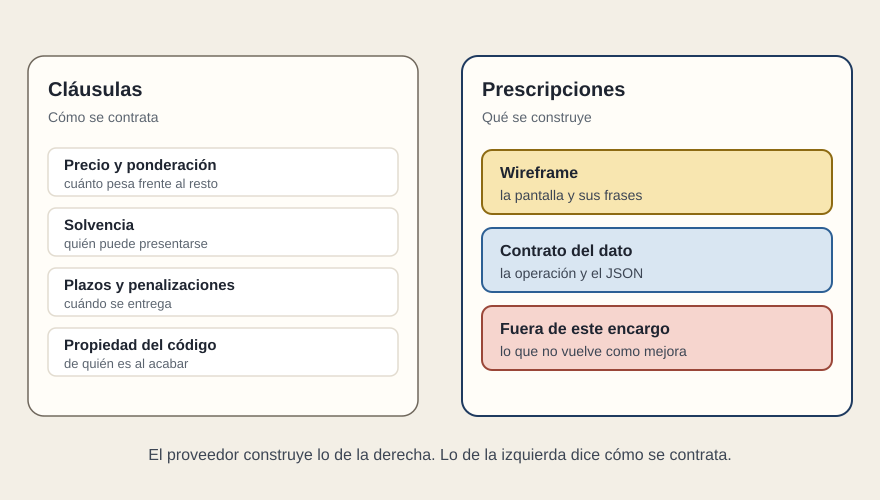

# Dos papeles

[← Página anterior](README.md) · [Siguiente página →](02-el-wireframe.md)

El encargo viaja en dos documentos, aunque a veces se encuadernen juntos. Las cláusulas dicen cómo se contrata. Las prescripciones dicen qué se construye. Este módulo es el segundo papel.

Si una frase no se puede señalar en un dibujo, en una respuesta o en un arranque, no es una prescripción. O pertenece a las cláusulas —precio, solvencia, plazos, de quién es el código— o es un adjetivo. «Moderna», «escalable» y «mejores prácticas» ocupan el párrafo y dejan la decisión para cuando ya hay un adjudicatario.

El objeto nombra quién usa qué. «Consulta del estado de las líneas» y «panel de sala para las incidencias» pueden ir en el mismo contrato. Son dos usos. Cada uno lleva su dibujo. «Aplicación React moderna» no nombra un uso: es el vocabulario que la oferta va a devolverte.

React entra en las prescripciones cuando la casa ya mantiene otras pantallas en React y la nueva tiene que poder vivir con ellas. Entra como restricción de mantenimiento, en la columna de sí o no. No entra como sinónimo de que el trabajo estará bien hecho, ni como un punto que sume a quien escriba el nombre.

## Qué preguntar

- ¿Esta frase se señala en una pantalla, en un JSON o en un arranque?
- ¿El marco es una restricción de la casa o un adorno del objeto?
- ¿El precio y la propiedad están en el otro papel?
