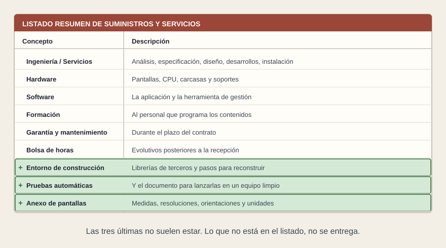
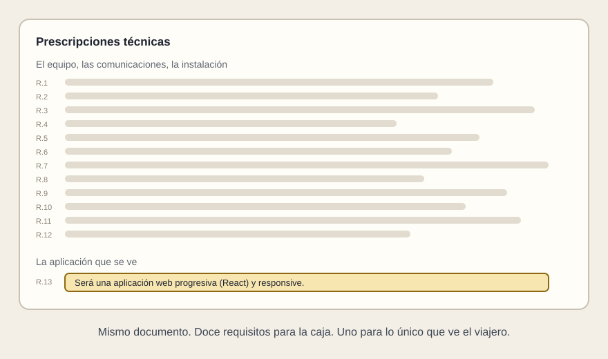

# Qué entra en el pliego

[← Página anterior](README.md) · [Siguiente página →](02-entregables.md)

Esta página es solo el pliego: primero el alcance, después los requerimientos. Son dos bloques distintos. Lo que hay que recibir, cómo se acepta y qué queda en garantía va en las páginas siguientes. Las frases listas para copiar están en el [ejemplo](05-ejemplo.md).

## El alcance

El alcance dice qué se suministra. Lo que no está en el listado no se entrega, y después no hay dónde reclamarlo.

Con una aplicación React, el software no es lo único que hay que listar. Hay tres ámbitos que, si no se nombran, no aparecen en la oferta.

**Entorno de construcción.** Una máquina, y vale una máquina virtual, capaz de fabricar el paquete. Lleva las librerías de terceros, con su versión y una copia. No es un entorno de preproducción ni de producción: fabrica el paquete, y ese paquete se instala después donde el pliego de implantación ya diga.

**Pruebas automáticas.** Unitarias y de extremo a extremo, con el documento para lanzarlas. Se ejecutan en un entorno del órgano de contratación, y superarlas es condición de recepción.

**Anexo de pantallas.** Medida, resolución, orientación, dónde va cada una, cuántas unidades, y el dibujo funcional de cada pantalla. «Responsive» se comprueba contra esa lista y contra ninguna más: una medida que no esté en el anexo es un cambio de alcance, no un defecto.

Cada ámbito se escribe en varias filas, en las familias de siempre. Por eso el dibujo no es una tabla: las filas están en el ejemplo, y cada una dice a qué ámbito pertenece.

## Los requerimientos

El alcance dice qué se compra. El requerimiento dice cómo se comprueba. Si hace falta interpretarlo, todavía no es un requerimiento.

La aplicación suele quedar en una frase: «será una aplicación web progresiva (React) y responsive». El equipo que la sostiene lleva decenas de filas que alguien puede probar. Esa frase no se puede medir ni rechazar en el acta.

Lo que el bloque de la aplicación tiene que poder probarse, aunque el diseño funcional todavía no esté cerrado:

- **Con dato, sin dato, con error y con un dato mal formado.** Una frase genérica en el pliego. El detalle se cierra y se aprueba antes de construir, y las pruebas cubren lo aprobado.
- **Qué se ve al arrancar, y qué se ve si no arranca.**
- **Qué pasa al recuperar una comunicación.** Si nadie vuelve a pedir el dato, la pantalla sigue mostrando el anterior.
- **Qué se puede cambiar sin fabricar otro paquete.** Textos, colores, medidas, posiciones, duraciones y direcciones de los datos. Van en un fichero de configuración, aparte del paquete. No van en el fichero de aspecto que el paquete genera: ese fichero se explica en la página siguiente.
- **Que no quede un programa del proveedor encendido.** La pantalla funciona abriendo los ficheros en el navegador del equipo. Si el proveedor deja un programa suyo en marcha para que se vea, esa pieza entra en el inventario y en el mantenimiento sin haber sido valorada.

**Tip.** Un requerimiento está bien escrito cuando alguien, delante de la pantalla, puede decir «cumple» o «no cumple» sin llamar a nadie.
