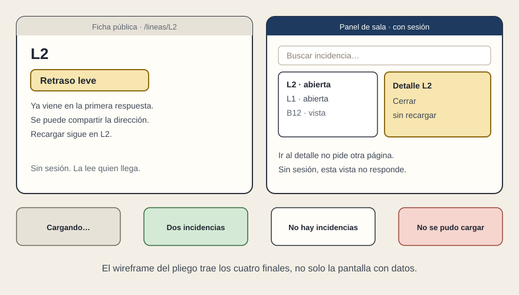

# El wireframe

[← Página anterior](01-dos-papeles.md) · [Siguiente página →](03-el-contrato.md)

El boceto del pliego no adorna el dosier. Es la lista de lo que la aceptación va a mirar. Sin cajas, el proveedor dibuja las suyas y las dos partes discuten el gusto.

Para cada superficie, el dibujo lleva escrito lo que el curso ya sabe separar:

- Quién está delante, y si hace falta sesión.
- Si la dirección se puede compartir y qué pasa al recargarla. En la ficha de L2, recargar sigue en L2. En el panel, el pliego elige una de las dos y la escribe: el detalle sobrevive, o se acepta volver al listado.
- Qué texto tiene que venir ya en la primera respuesta. En la ficha pública, el estado de la línea. En el panel, puede llegar después, pero la espera tiene frase.
- Los cuatro finales, en cuatro recuadros: cargando, con datos, con cero y con fallo. Un solo dibujo feliz no basta para aceptar.

La ficha y el panel no comparten wireframe. Comparten el dato del estado de la línea. No comparten el acceso: la nota de sala y el teléfono de guardia no aparecen en la ficha.

Lo que este encargo no compra se escribe al lado del dibujo: app de tienda, puesto que se instala, aviso que llega solo, trabajo sin cobertura. Si no está escrito, vuelve en la oferta como mejora. Una mejora que abre otra superficie no mejora el panel: cambia el encargo.

El wireframe puede ser basta. Cajas, nombres y frases. No hace falta el color final ni el icono definitivo. Hace falta que cada caja tenga un solo trabajo, como en el boceto del panel de servicio, y que las filas repetidas sean la misma pieza.

## Qué preguntar

- ¿Cada caja tiene frase también cuando no hay datos?
- ¿La ficha pública y el panel son dos dibujos?
- ¿Lo que queda fuera está escrito al lado?
