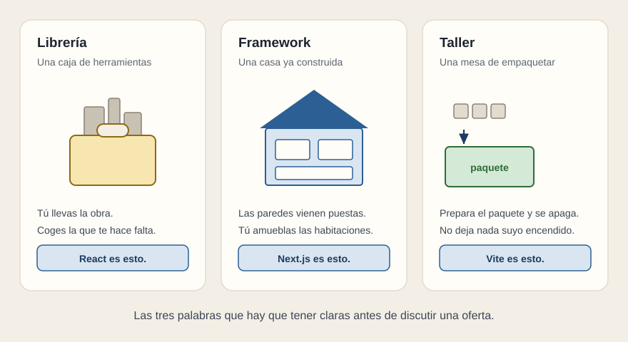

# Tres palabras: librería, framework y taller

[← Página anterior](01-una-frase.md) · [Siguiente página →](03-dos-encargos.md)

- **Librería: una caja de herramientas.** Tú llevas la obra. Coges la herramienta que te hace falta y la dejas cuando terminas. No te dice en qué orden trabajar ni cómo organizar el proyecto. **React es esto.**

- **Framework: una casa ya construida.** Las paredes y los pasillos vienen puestos, y tú amueblas las habitaciones que te deja. Se trabaja más guiado y más encajonado. **Next.js es esto**, y de ahí la sensación de que recuerda a Angular.

- **Taller: una mesa de empaquetar.** Recoge lo que escribió el equipo y prepara el paquete que se instala en el equipo. Cuando acaba, se apaga: no deja nada suyo funcionando. **Vite es esto.**

- **Por qué esto importa en un pliego, y no es una curiosidad.** La caja de herramientas y la mesa desaparecen el día de la entrega. La casa se queda encendida. Y todo lo que se queda encendido hay que instalarlo, vigilarlo, actualizarlo, parchearlo y certificarlo durante los veinte años de vida del sistema.

- **Lo que nunca hay que hacer.** Nombrar una de las tres en el pliego porque suene moderna. Si se nombra, que sea por el motivo real: porque el equipo que va a heredar el mantenimiento ya trabaja con ella.

**Tip.** Cuando una oferta mezcle los tres nombres como si fueran alternativas entre sí, es señal de que quien la escribió no ha decidido nada todavía. React y Vite se usan juntos; Next.js ya trae dentro su propia mesa de empaquetar.
