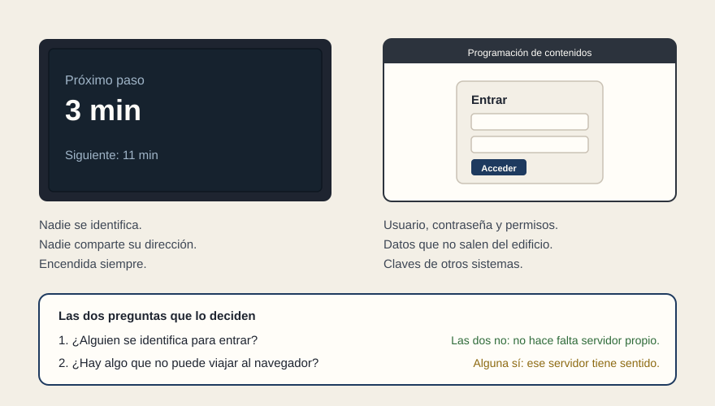

# No todas las pantallas son la misma pantalla

[← Página anterior](02-tres-palabras.md) · [Siguiente página →](04-la-entrega.md)

- **En el mismo pliego viajan dos encargos.** La pantalla que mira el público, y la herramienta con la que el personal programa lo que sale en esa pantalla.

- **La del público.** Nadie se identifica delante de ella. Nadie comparte su dirección. No la busca nadie en un buscador. Está encendida siempre y nadie la vuelve a abrir.

- **La del personal.** Usuario, contraseña y permisos por perfil. Datos que no deben salir del edificio. Claves de acceso a otros sistemas.

- **El error caro del pliego.** Pedir las dos con la misma frase. El proveedor cotiza la fácil y descubre la difícil a mitad de proyecto, y esa conversación ya la pagas tú.

- **Las dos preguntas que lo deciden.** ¿Alguien se identifica para entrar? ¿Hay algo que no puede viajar al navegador, una contraseña o una clave de un servicio de pago? Si las dos respuestas son no, no hace falta la casa de la página anterior: solo añade una pieza que mantener. Si alguna es sí, esa casa es el sitio natural de lo que no puede verse.

- **Y se escribe sin nombrar herramientas.** Dos frases:

> La aplicación de las pantallas se entregará como archivos que el navegador del equipo abre directamente, sin ningún servicio del proveedor que deba permanecer en ejecución para que la pantalla funcione.

> La herramienta de gestión de contenidos tendrá acceso por usuario y perfil. Ninguna credencial de acceso a sistemas de terceros estará presente en el navegador del operador.

**Tip.** Con esas dos frases en el pliego, el proveedor ya no puede meter un servidor dentro del tren ni dejar una contraseña a la vista de cualquiera que abra la pantalla.
