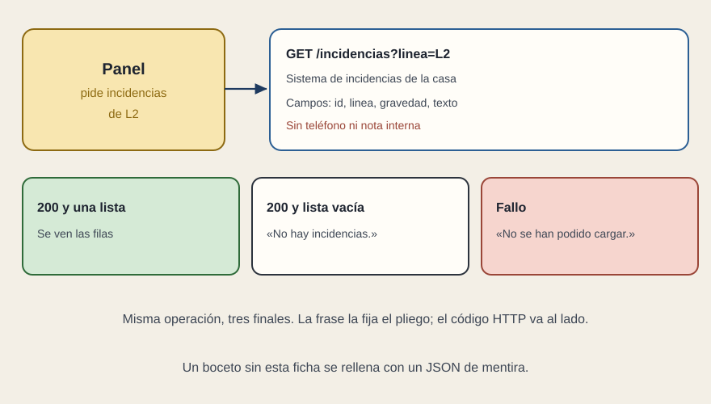

# El contrato del dato

[← Página anterior](02-el-wireframe.md) · [Siguiente página →](04-librerias.md)

El wireframe dice qué se ve. El contrato dice de dónde sale y con qué forma. Van juntos. Un boceto sin contrato se rellena con un JSON de mentira, el de una demo. Un contrato sin boceto no dice qué campos sobran.

Para cada operación que una caja del wireframe dispara, basta una ficha:

- Verbo y camino. `GET /incidencias?linea=L2`. `POST` para cerrar una incidencia, si cerrar entra en el encargo.
- El sistema de la casa que hay detrás de esa puerta. «Una API REST» no nombra a nadie. Si ese sistema todavía no existe, el pliego encarga definirlo, no solo pintar la pantalla que lo espera.
- Los campos que la pantalla usa: identificador, línea, gravedad, texto del estado. Los que no pinta no viajan en esa respuesta. El teléfono personal y la nota interna no van en la ficha pública, aunque el sistema los guarde.
- Tres finales traducidos a frase de persona: hay filas, no hay ninguna, no se ha podido cargar. El código de la respuesta puede ir al lado. La aceptación mira la frase. Vacío y fallo no comparten texto.

El mismo hecho no tiene dos formas. Si la ficha dice «retraso leve» y el panel, para esa misma línea, dice otra cosa, el contrato está partido y las dos pantallas mienten una respecto de la otra.

No hace falta pegar aquí el catálogo entero del sistema, ni un OpenAPI de cientos de operaciones, salvo que la casa ya viva con ese documento y se pueda citar. Para encargar la pantalla bastan las operaciones que el wireframe nombra. El resto se referencia. Copiarlo entero al pliego lo deja viejo el día que el sistema cambia una operación que esta pantalla ni usa.

Si además hay una vía en vivo —un aviso que llega solo— es otra ficha: qué mensaje entra, qué frase se ve, y qué se ve si la vía calla. No se resuelve añadiendo la palabra WebSocket al objeto.

## Qué preguntar

- ¿Cada caja del wireframe señala una operación con nombre?
- ¿Vacío y error son dos respuestas escritas?
- ¿Los campos que no se pintan están fuera de esa respuesta?
