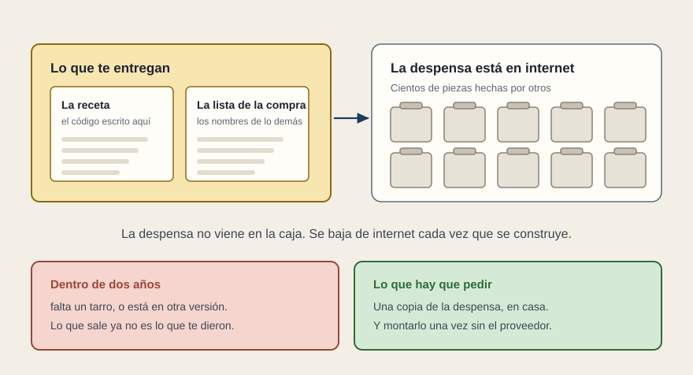

# Las fuentes y los entregables

[← Página anterior](02-requerimientos.md) · [Siguiente página →](04-aceptacion.md)

- **Esto ya lo pedís, y bien.** Las herramientas necesarias con el código fuente, por ejemplo en una máquina virtual, con el entorno de desarrollo configurado, y el documento con los pasos para obtener el paquete de distribución.

- **Con React se puede cumplir al pie de la letra y no bastar.** Lo que recibes es el código escrito para este encargo y una lista de nombres. Las librerías de terceros —piezas hechas por otros, reutilizadas— no vienen con el código: se bajan de internet cada vez que se fabrica el paquete. En una aplicación React son cientos, y eso es lo normal.

- **Lo que pasa a los dos años.** Una librería ya no está donde estaba, o está en otra versión. Lo que sale deja de ser lo que te entregaron, y nadie puede explicar por qué, porque el proveedor cumplió el pliego.

- **Tres líneas que lo cierran.** El fichero donde queda anotada la versión exacta de cada librería. Una copia de esas librerías en poder del órgano de contratación, para poder fabricar sin internet. Y la reconstrucción hecha por personal propio, en un equipo limpio, antes de firmar la recepción.

- **La última es la única que cierra el riesgo de verdad.** Y es una tarde.

- **Y la documentación.** Donde el pliego pide diagrama de clases y casos de uso, en React no hay clases que dibujar: recibirás un documento de trámite. Lo que ocupa ese sitio es el inventario de piezas de pantalla: qué muestra cada una, dentro de cuál aparece, qué datos recibe y de qué sistema sale cada dato.

**Tip de reunión.** «¿Podemos fabricar el paquete nosotros, hoy, aquí, con vuestro documento delante?» Si hace falta alguien del proveedor, la entrega no está completa, esté firmada o no.
