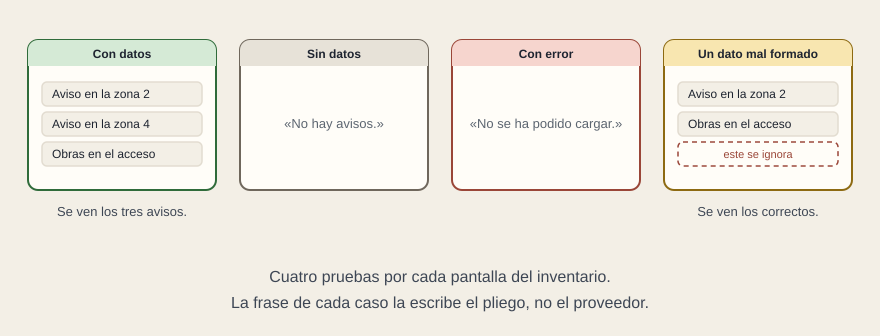

# Las pruebas de aceptación

[← Página anterior](03-fuentes.md) · [Siguiente página →](05-garantia.md)

- **El marco ya existe.** Plan de pruebas que redacta el adjudicatario y aprueba TMB, pruebas en las instalaciones del proveedor, pruebas en destino, y acta con la lista de pruebas, el resultado de cada una y el cuadro de deficiencias.

- **Lo que falta es qué entra en esa lista por la parte de la aplicación.** Cuatro familias, y las cuatro se escriben sin saber programar.

- **Con el dato normal.** Una imagen de referencia por cada combinación del anexo de pantallas, aprobada antes de las pruebas y no durante.

- **Sin el dato.** Aquí hay un atajo: la tabla de averías del pliego ya tiene las situaciones escritas una por una. La lista de pruebas sale de ahí, casilla por casilla. No hay que inventarla, hay que exigir que el plan la recorra entera.

- **Lo que aguanta.** La prueba de semanas encendido de la página siguiente.

- **Lo que se puede volver a pasar.** Un programa aparte abre la aplicación, le entrega datos preparados —la lista normal, la lista vacía, una respuesta con error, un elemento mal formado— y comprueba que sale lo que el pliego dijo. Tarda segundos y no necesita el equipo real.

- **Y se pide como condición de recepción.** Las pruebas automáticas se lanzan delante de TMB y tienen que pasar todas. Si no, no es una entrega, es una promesa.

## Señales de alerta en un plan de pruebas

- No hay ninguna prueba en la que el dato no llegue.
- Todas las capturas son de la misma pantalla y del mismo tamaño.
- Dice «se verificará manualmente» y no hay lista de qué se verifica.
- Las pruebas automáticas existen, pero solo se pueden lanzar en el equipo de una persona del proveedor.

**Tip.** Las cuatro se corrigen antes de aprobar el plan. Ninguna se corrige después.
