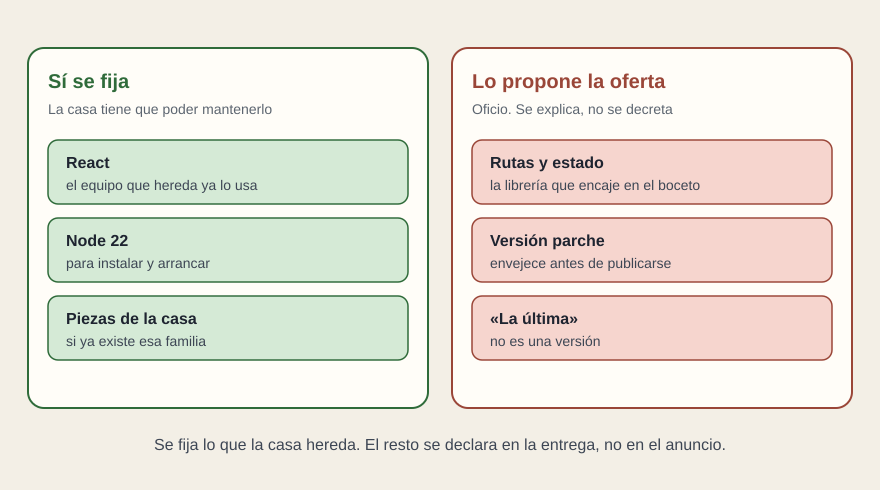

# Librerías y versiones

[← Página anterior](03-el-contrato.md) · [Siguiente página →](05-como-se-cierra.md)

Aquí conviene ser tacaño. Fijar una librería en el pliego obliga a la casa a mantenerla durante años. Dejarla libre se la encarga a quien va a construir, que es quien conoce el oficio, con la obligación de explicar la elección.

Tiene sentido fijarlo cuando la casa ya lo hereda:

- El marco, si es restricción de verdad. React, porque el equipo que recibirá la pantalla ya mantiene otras en React. Entonces es un requisito de sí o no. Cumplirlo no da puntos. No cumplirlo aparta la oferta.
- La versión mayor con la que se va a poder instalar y arrancar. Node 22, si ese es el taller de la casa. Sin un número mayor, «se entrega el repositorio» no se puede comprobar en una máquina limpia.
- Un sistema de piezas o de estilos que ya tenga nombre en la casa. La pantalla nueva entra en esa familia. No se le pide que invente otra.

No tiene sentido fijarlo cuando es oficio o moda:

- La librería de rutas, la de estado o la de peticiones. La oferta dice cuál usa y por qué cabe en el wireframe. Exigir una concreta, copiada de un proyecto anterior, solo parece precisión.
- La versión parche. React 19.0.3 contra 19.0.4 envejece antes de que el pliego se publique. Si hace falta un suelo, se escribe la mayor.
- «La última versión». No es una versión. El día de la entrega y el día en que alguien tenga que mantenerla son dos días. La oferta declara las versiones con las que entrega, y eso se congela en la aceptación, no en el anuncio.

Angular o Vue, si la casa ya vive en uno de ellos, se tratan igual que React: restricción de herencia, no premio. Pedir React y a la vez «la mejor tecnología» pide dos cosas que no caben en la misma frase. Quien licita cumplirá la que le salga más barata de argumentar.

## Qué preguntar

- ¿Esta librería está aquí porque la casa la mantiene, o porque sonaba técnica?
- ¿La versión es una mayor, un parche o la palabra «última»?
- ¿La oferta explica las que el pliego dejó libres, con el número con el que va a entregar?
