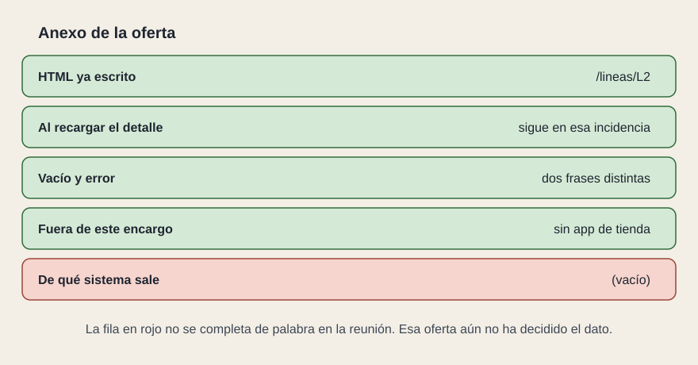

# Cómo se cierra

[← Página anterior](04-librerias.md) · [Siguiente página →](06-modelo.md)

Lo obligatorio se cumple o la oferta no sigue. Lo puntuable ordena a las que ya cumplen. Puntuar «usa React», cuando React era obligatorio, no distingue a nadie: todas las que siguen ya lo usan.

En el ejemplo de la red, obligatorio cabe en pocas pruebas:

- La ficha de L2 se abre por su dirección y el estado viene en la primera respuesta.
- El panel no responde sin sesión, y pasar al detalle no recarga la página.
- «No hay incidencias abiertas» y «No se han podido cargar» son dos frases.
- El texto de un estado de servicio se cambia en un solo sitio y se ve en la ficha y en el panel.
- El proyecto arranca con la versión mayor de Node que el pliego fijó.

Puntuable, solo si hay que ordenar varias ofertas que ya pasan eso: el anexo completo, ruta por ruta; que la ficha se pueda leer pronto en esa dirección concreta; que el panel se use con la ventana estrecha y sin depender del color. El peso del precio frente a estos criterios vive en las cláusulas. Aquí solo se dice qué se mira.

La oferta adjunta el anexo relleno. Dónde nace el HTML. Qué pasa al recargar. De qué sistema sale cada dato, con la operación. Las cuatro frases. Qué queda fuera. Cómo se arranca. Si el marco no venía fijado, cuál proponen y por qué encaja en el wireframe. Una celda vacía no se completa de palabra en la reunión: esa oferta todavía no ha decidido el producto.

El mismo anexo sirve el día de la entrega. Se cambia «la oferta dice» por «la pantalla muestra». Si no coinciden, no se ha entregado el encargo.

La página siguiente junta todo esto en un modelo. Se puede copiar y cambiar los nombres del sistema. No se puede publicar tal cual: le faltan las cláusulas.
