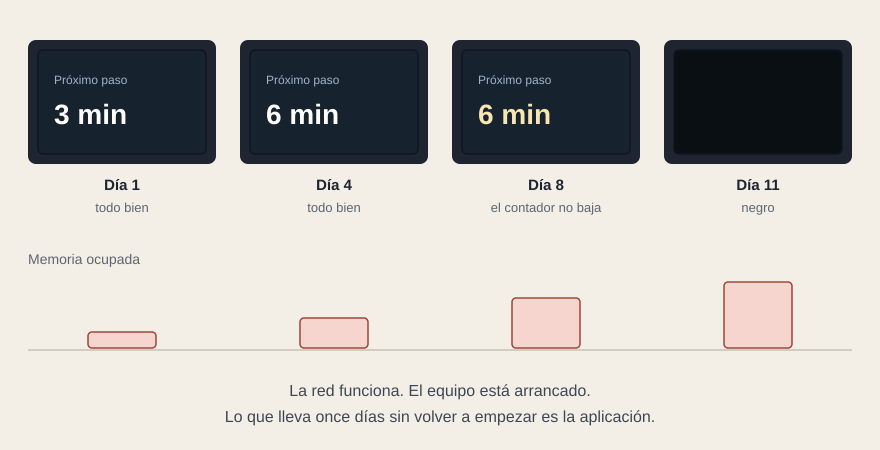

# La garantía y la bolsa de horas

[← Página anterior](04-aceptacion.md) · [Siguiente página →](06-ejemplo.md)

- **Lo que el pliego ya cubre.** El equipo: arranque por debajo de un tiempo dado, aguantar cortes de alimentación, sobrevivir a reinicios no controlados, vigilarse y recuperarse solo. Y el contenido: las tablas de averías, con reintentos, última versión válida y contenido de reserva.

- **La casilla que falta es la aplicación.** Equipo arrancado, contenido llegando, y la aplicación once días sin volver a empezar porque nadie la cierra nunca.

- **Se va comiendo la memoria** hasta que el navegador la descarta y la pantalla se queda en negro. Parece avería de red, y la red funciona.

- **La hora se queda quieta.** El contador no baja. La pantalla sigue informando, y lo que informa es falso. Nadie lo reporta, porque desde fuera se ve encendida y con contenido.

- **Al volver el enlace se sigue viendo lo viejo**, porque el dato volvió y nadie lo pidió otra vez.

- **Y los fallos no quedan en ninguna parte.** Por defecto se escriben en un sitio al que solo se llega enchufando un teclado al equipo. Si el pliego no dice que acaben en los registros que ya se recogen, nadie se enterará nunca.

- **Cuatro requerimientos lo cubren.** Semanas sin reinicio con memoria estable y medido en el acta. La información temporal recalculada con el reloj del equipo. Volver a pedir todo lo visible al recuperar comunicación. Y los fallos en los registros del sistema.

- **La bolsa de horas es la licitación siguiente en pequeño.** Cada evolutivo tiene que comprobar que lo nuevo no rompió lo viejo. Con pruebas automáticas eso es una tarde; sin ellas, cada evolutivo vuelve a ser una recepción entera, y la bolsa se gasta en comprobar en vez de en mejorar.

**Tip.** La prueba que destapa casi todo esto no cuesta dinero: dejarla encendida un puente y mirarla el martes. Que figure en el plan, con fotografía al final.
