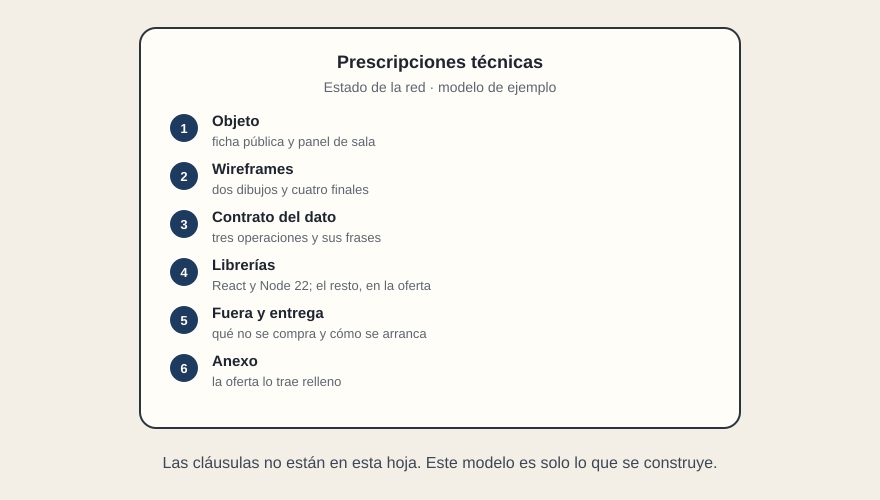

# Modelo de pliego

[← Página anterior](05-como-se-cierra.md) · [Siguiente página →](../../modulos/M01-ecosistema-react/README.md)

Esto es un modelo de **prescripciones técnicas**, el papel que dice qué se construye. No es un pliego publicable: faltan las cláusulas (precio, solvencia, plazos, propiedad) y los nombres reales de los sistemas. Se puede copiar y sustituir. Las frases entre comillas son las que la aceptación tiene que poder leer en pantalla.



## 1. Objeto

Consulta pública del estado de las líneas, y panel de sala para las incidencias de esas líneas. Dos superficies. Un mismo dato de estado. Accesos distintos.

La ficha la abre quien llega, sin sesión. El panel lo usa quien está de turno, con sesión. La nota de sala y el teléfono de guardia no aparecen en la ficha.

## 2. Wireframes

Hay dos dibujos, no uno. El de la ficha y el del panel de este curso valen como punto de partida: [la ficha de L2 y el panel, con los cuatro finales](../img/wireframe-pliego.svg).

**Ficha pública.** Dirección `/lineas/L2` (y la equivalente para cada línea). Recargar sigue en esa línea. El nombre y el estado viajan en el HTML de la primera respuesta. El estado va escrito, no solo en un color. No hay sesión.

**Panel de sala.** Listado de incidencias abiertas y detalle de una. Pasar de uno a otro no recarga la página. Recargar el detalle vuelve a abrir ese detalle. Sin sesión, la ruta no entrega incidencias.

**Cuatro finales del panel**, con estas frases:

| Momento | Frase |
|---------|--------|
| Mientras no hay respuesta | «Cargando incidencias.» |
| Con datos | El listado, con identificador y línea |
| Con cero | «No hay incidencias abiertas.» |
| Si la petición falla | «No se han podido cargar las incidencias.» |

Cerrar una incidencia, si la operación responde bien: «Incidencia cerrada.» Si no se ha podido guardar: «No se ha podido cerrar la incidencia.»

El texto «Retraso leve» se cambia en un solo sitio y se ve en la ficha y en el panel.

## 3. Contrato del dato

Cada caja del wireframe señala una operación. El sistema que hay detrás se nombra aquí; en este modelo, los nombres son de ejemplo.

**Estado de una línea.** Lo sirve el Sistema de información al viajero.

```text
GET /lineas/L2

200
{ "nombre": "L2", "modo": "Metro", "estado": "Retraso leve" }
```

La ficha pinta `nombre` y `estado`. No pide más campos. Un fallo de esta lectura muestra «No se ha podido cargar el estado de la línea.», distinto de una línea que existe y está en servicio.

**Incidencias abiertas.** Las sirve el Sistema de incidencias.

```text
GET /incidencias?linea=L2

200 y lista
[{ "id": "INC-14", "linea": "L2", "gravedad": "leve", "texto": "Retraso leve" }]

200 y lista vacía
[]
Frase: «No hay incidencias abiertas.»

Fallo
Frase: «No se han podido cargar las incidencias.»
```

La respuesta no trae teléfono ni nota interna. Esos campos pueden existir en el sistema; no viajan hacia la pantalla.

**Cierre.**

```text
POST /incidencias/INC-14/cierre

Guardado     «Incidencia cerrada.»
No guardado  «No se ha podido cerrar la incidencia.»
```

El mismo hecho no tiene dos textos. Si la ficha dice «Retraso leve», el panel no inventa otro rótulo para esa línea.

No se copia aquí el catálogo entero de esos sistemas. Solo las operaciones que los wireframes nombran. El resto se cita, no se pega.

## 4. Librerías y versiones

- La interfaz se construye con React. Es restricción de casa: el equipo que la mantendrá ya mantiene otras pantallas en React. Cumplirlo no suma puntos. No cumplirlo aparta la oferta.
- El proyecto se instala y arranca con Node 22.
- Si la casa tiene ya un sistema de piezas con nombre, la pantalla entra en esa familia. En este modelo, ese nombre se sustituye por el real o se borra la frase.
- La librería de rutas, la de estado y la de peticiones las elige la oferta y las declara, con la versión mayor y menor con la que va a entregar. El pliego no las fija.
- No se escribe «la última versión». No se fija un parche (`19.0.3`).

## 5. Fuera de este encargo

App de tienda, puesto que se instala, canal que empuje el aviso solo, trabajo sin cobertura, mapa. Ofrecerlos no es una mejora. Una mejora solo cabe si se añade a esta lista antes de publicar, y si no abre otra superficie.

## 6. Entrega y comprobación

El repositorio se instala y arranca, en una máquina limpia, con los comandos declarados en el propio proyecto y con Node 22, contra un entorno de prueba de los dos sistemas nombrados.

En el repositorio hay una página corta que dice, ruta por ruta, dónde nace el HTML, dónde vive el estado del panel y qué fichero llama a cada operación.

La aceptación recorre esto, y lo señala en la pantalla:

1. Abrir `/lineas/L2` y leer el estado en el HTML de esa respuesta, sin esperar a un programa.
2. Abrir el panel sin sesión y comprobar que no entrega incidencias.
3. Ver las cuatro frases del panel: carga, datos, cero y fallo.
4. Cerrar una incidencia y ver la frase de guardado; repetir el gesto cuando el sistema rechaza y ver la otra frase.
5. Cambiar «Retraso leve» por «Demora» en un solo sitio y verlo en la ficha y en el panel.
6. Estrechar la ventana: el texto se lee y los botones se pueden pulsar. El estado sigue escrito, no solo pintado de un color.

## 7. Anexo que trae la oferta

Sin este anexo relleno, la oferta no se lee. Donde contradiga al dosier, manda el anexo.

| Pregunta | Respuesta de la oferta |
|----------|------------------------|
| ¿Qué direcciones llegan ya escritas en el HTML? | |
| ¿Qué pasa al recargar el detalle del panel? | |
| ¿Dónde vive el filtro y la incidencia en curso? | |
| ¿Qué sistema y qué operación alimentan cada caja? | |
| ¿Cuáles son las cuatro frases, literales? | |
| ¿Qué queda fuera, sin añadidos? | |
| ¿Con qué comandos se instala y arranca, y con qué Node? | |
| ¿Qué librerías de rutas, estado y peticiones, y en qué versión se entregan? | |

El día de la entrega se usa la misma tabla. Se cambia «la oferta dice» por «la pantalla muestra».

El otro recorrido del curso abre las demos y enseña, con aplicaciones pequeñas, las diferencias que este modelo ya da por escritas.
